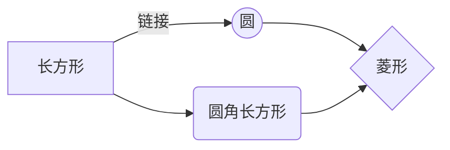

# 一级标题
## 二级标题
### 三级标题
#### 四级标题
##### 五级标题
###### 六级标题

参考链接：
[https://istio.io/latest/docs/ops/integrations/prometheus/](https://istio.io/latest/docs/ops/integrations/prometheus/)
[Prometheus-中文文档](https://prometheus.fuckcloudnative.io/)

yaml配置
```yaml
# prom服务端全局配置
global:
  # 抓取(scrape)间隔15s 
  scrape_interval:     15s
  # 执行规则（evaluate rules）频率15s
  evaluation_interval: 15s
```

bash命令
```bash
./prometheus --config.file=prometheus.yml
```

```java
public static void main(String[] args) {
    System.out.println("hello world!");
}
```

无序列表
- `up{job="<job-name>", instance="<instance-id>"}`: 1 if the instance is healthy, i.e. reachable, or 0 if the scrape failed.
- scrape_duration_seconds{job="<job-name>", instance="<instance-id>"}: duration of the scrape.
- scrape_samples_post_metric_relabeling{job="<job-name>", instance="<instance-id>"}: the number of samples remaining after metric relabeling was applied.
- scrape_samples_scraped{job="<job-name>", instance="<instance-id>"}: the number of samples the target exposed.
- scrape_series_added{job="<job-name>", instance="<instance-id>"}: the approximate number of new series in this scrape. New in v2.10

有序列表
1. hello
2. world
3. :star:


表格

项目     | Value
-------- | -----
电脑  | $1600
手机  | $12
导管  | $1

| Column 1 | Column 2      |
|:--------:| -------------:|
| centered 文本居中 | right-aligned 文本居右 |

flowchart

