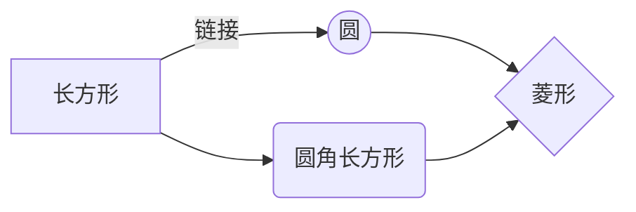

# 一级标题
## 二级标题
### 三级标题
#### 四级标题
##### 五级标题
###### 六级标题

参考链接：
- [https://istio.io/latest/docs/ops/integrations/prometheus/](https://istio.io/latest/docs/ops/integrations/prometheus/)
- [Prometheus-中文文档](https://prometheus.fuckcloudnative.io/)

yaml配置
```yaml
# prom服务端全局配置
global:
  # 抓取(scrape)间隔15s 
  scrape_interval:     15s
  # 执行规则（evaluate rules）频率15s
  evaluation_interval: 15s
```

bash命令
```bash
./prometheus --config.file=prometheus.yml
```
java代码
```java
public static void main(String[] args) {
    System.out.println("hello world!");
}
```

无序列表
- `hello` world
- hello `Morning`
- smile

有序列表
1. hello
2. world
3. :star:

>你好
>中国
>世界

表格

项目     | Value
-------- | -----
电脑  | $1600
手机  | $12
导管  | $1

| Column 1 | Column 2      |
|:--------:| -------------:|
| centered 文本居中 | right-aligned 文本居右 |

flowchart

